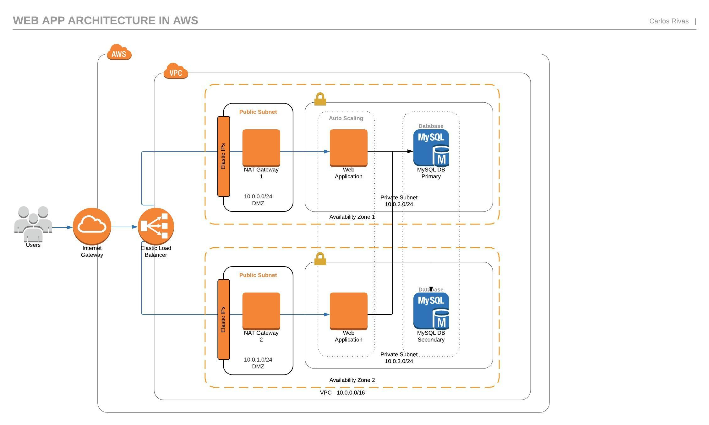

# Some simple template of aws-cloudformation

## 1. Web-App-ELB-EC2-AutoScale


## 2. Simple-VPC


## 3. deploy-server-in-pri-subnet


## 4. deploy-MySQL-database
```
Deploy MySQL instance in a private subnet
```
## 5. cloudformation-basic
